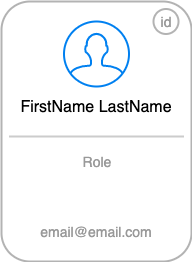

# Parte I - Info Cards (30 pts.)


## REST [API]({{ api.url }}) endpoints

Usted interactua con un [API]({{ api.url }}) y obtendra una respuesta en JSON que usted debera parsear.

Esta respuesta representa la estructura organizacional de una empresa ficticia, este JSON tendra dos arrays:

- [management:]({{api.management}}) representa a los fundadores y los chief heads de la empresa
- [team:]({{api.team}}) representa a los demas empleados

## Info Cards
Usted debera crear containers (info cards, puede ver la seccion de [Cards](resources.md#html-cards) 😉 ) que tengan y representen cada uno de los campos para cada empleado. 

<br>
> (Por favor que ni se le pase por la mente quemar o hardcodear)

<br>



<br>
Cada campo del JSON response debera ser mapeado a esta card.

```javascript
{
    "id": 5,
    "email": "charles.morris@reqres.in",
    "first_name": "Charles",
    "last_name": "Morris",
    "role": "CMO",
    "avatar": "https://s3.amazonaws.com/uifaces/faces/twitter/stephenmoon/128.jpg"
},
```


<br>

- **id:** se muestra en la parte superior derecha.
- **avatar:** es la imagen de cada empleado
- **first_name:** FirstName
- **last_name:** LastName
- **role:** abajo del nombre completo


## Observaciones

- Debera interactuar y utilizar metodos http REST para obtener el JSON response (recuerde `'Content-Type: application/json'`)
- Ya hay librerias de python para hacer requests a REST endpoints
- Ya existen librerias de python para parsear json.
- Flask + Jinja + HTML + CSS le permitiran generar estas cards.
- se debera crear una card por cada empleado
- NO debe ser en forma de grid, es decir debe ser como se muestra en la siguiente parte
- Resuelva esto de una manera programatica, es decir de una manera que le permita interactuar con ambos API endpoint de una forma uniforme y sin repetir codigo, vea que hay 2 endpoints pero es el mismo schema/formato de respuesta.
