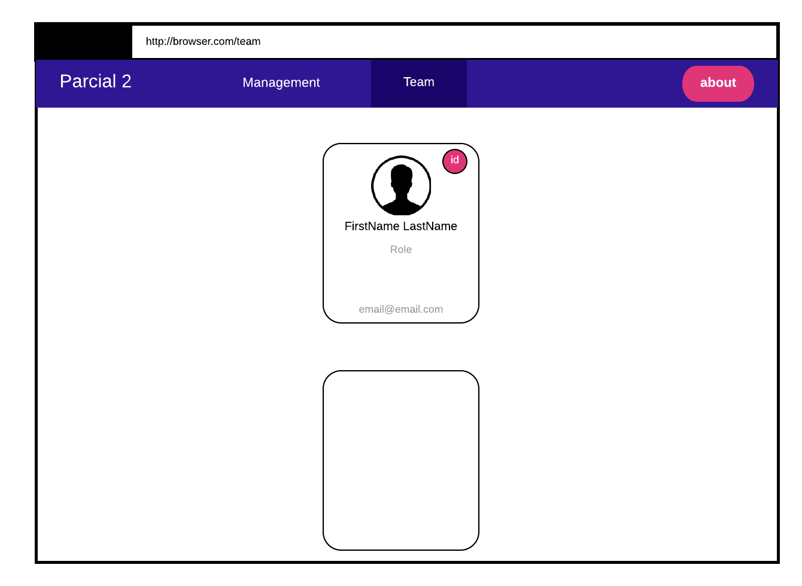

# Parte II - (60 pts)

<!-- TOC -->

- [Parte II - (60 pts)](#parte-ii---60-pts)
  - [Descripcion](#descripcion)
  - [Web Page](#web-page)
  - [Observaciones](#observaciones)

<!-- /TOC -->

## Descripcion

Una vez completada la [Parte 1](parte1.md) ahora debe crear un home page con los siguientes elementos:

- navbar:
  - Title: Parcial 2 o lo que usted desee
  - [Management]({{api.management}}): donde se deplegara los info cards de cada una de las personas que se encuentren trabajando en la empresa en el [management]({{api.management}}) team
  - [Team]({{api.team}}): se deplegara los info cards de cada persona que trabaje dentro del [team]({{api.team}}) que ocupen cualquier otro puesto.
  - About: donde se desplegara informacion acerca de Usted, en la [Parte 3](parte3.md)

- List: lista de containers con cada info card, OJO es solamente en 1 columna.

## Web Page
La pagina debera verse asi:

## Observaciones

- Preste atención a los colores que se utilizan (css) [Material Design], PERO USTED PUEDE HACERLO PERSONALIZADO Y AGREGAR LOS COLORES O DISENOS QUE USTED QUIERA
- Preste atención a la ubicacion de las cosas.
- Vea que el about es un  "boton" de color fuschia.
- NO es un grid, es en una sola columna.
- La segunda info card aparece en "blanco" porque es una copia de la de arriba pero con datos diferentes (es otro empleado)
- Por favor que ni se le pase por la mente quemar o hardcodear
