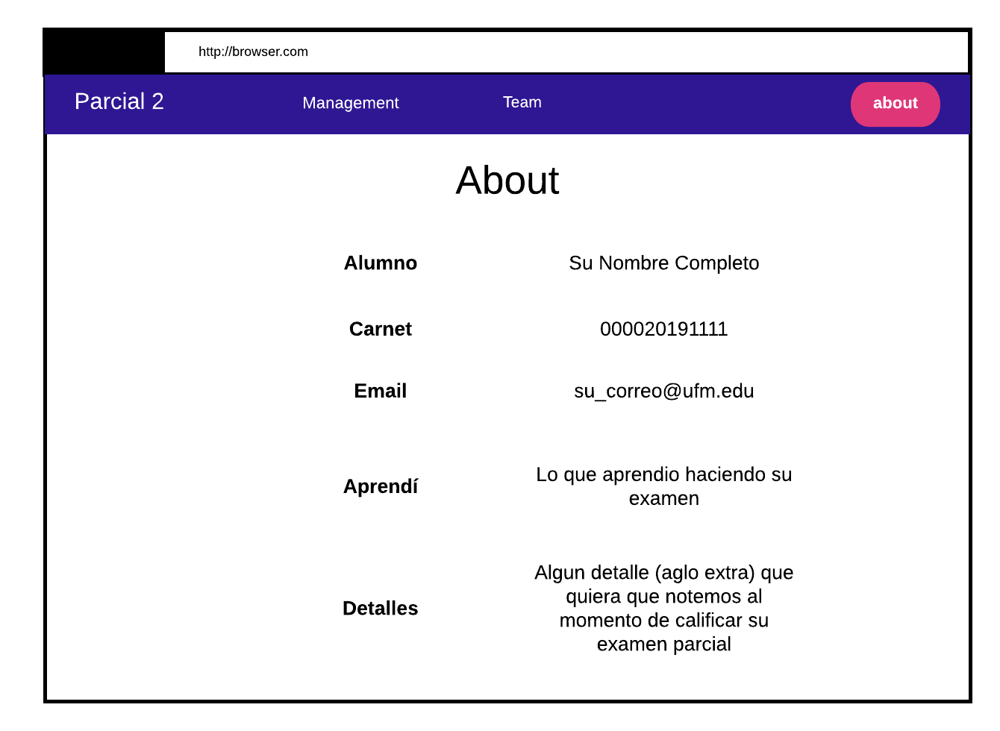

# Parte III (10 pts)

## About

En esta parte usted creara un about acerca de usted, de la forma como se muestra en el siguiente mock:

## Observaciones
- Ponga atención a cada campo listado.
- Quizas la unica parte en la que debe de hardcode o puede usar variables.